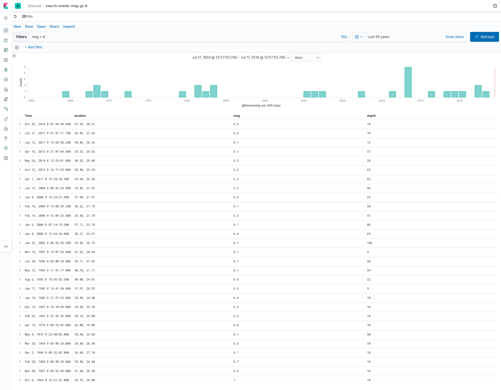

# Using the Elastic stack to process seismicity data in Greece

This is a simple demonstration of the use of ElasticSearch, Kibana, Logstash,
and Filebeat, to index and post-process seismicity data in Greece.

It is inspired by the following official tutorials:

* [Earthquake data with the Elastic Stack][elk-demo-full]
* [Elasticon tour 16 demo][elasticon16-demo]

I have made a [fork][personal-fork-dev] of the latter to implement the steps
with ELK 7.2 in Docker. This demonstration follows the docker implementation.

## Data source

The seismicity data include events logged from 1964 and up to this date,
downloaded from the site of the Institute of Geodynamics of the National
Observatory of Athens ([link][gein-noa-source]).

## System requirements

* `docker`
* `docker-compose`

## Use the Elastic Stack

We will use `docker-compose` to start the necessary services in each step of the
process. Here is a map of the services and the respective operations:

* **Elasticsearch**: Indexing, search, and analysis
* **Filebeat**: Collect the data.
* **Logstash**: Invoke the pipeline
  - Collect the data through **Filebeat**
  - Transform the data through built-in plugins.
  - Index the data through **ElasticSearch**.
* **Kibana**: Explore and visualize the indexed data.

### Summary of operations

* Invoke the pipeline

    $ docker-compose up logstash

  This starts also the `es0` service, that is the elasticsearch server,
  at http://localhost:9200.

* Start harvesting the data

  Once `logstash` is up and running, you can start the `filebeat`
  service

    $ docker-compose up filebeat

  You can monitor the creation of the index by direct calls to Elasticsearch
  API, like so:

    $ curl -XGET 'localhost:9200/\_cat/indices?v'
    health status index                uuid                   pri rep docs.count docs.deleted store.size pri.store.size
    green  open   gein-noa-earthquakes bWjO5dKQRuujui\_N-Dk-4w   1   0     276401 0     67.6mb         67.6mb

  This is the final count (i.e. 276401) of document for this particular example.

* Explore and visualize in Kibana

    $ docker-compose up -d kibana

  Visit http://localhost:5601 and perform the following:

  - Create an index-pattern **gein-noa-earthquakes** to explore (`Management -> Index Patterns`)
  - Import the saved objects (`*.ndjson`) from `kibana-objects/`
    (`Management -> Saved Objects`)
  - Select the `gein-noa-catalog` dashboard to have an overview of the data

    

    Each visualization can be reviewed and modified either by editing the
    dashboard and selecting the panel of interest for further editing, or
    by directly editing the visualization of choice through the `Saved Objects`
    pane of the application.

  - Select the `search-events-mag-gt-6` saved object to see an example of a
    search query.

    

[elk-demo-full]: https://www.elastic.co/blog/earthquake-data-with-the-elastic-stack
    "Earthquake data with the Elastic Stack"
[elasticon16-demo]: https://github.com/tbragin/elasticon_tour16_demo
    "ElasticON 16 Kibana demo"
[personal-fork-dev]: https://github.com/kodemartin/elasticon_tour16_demo/tree/docker-elk-7
[gein-noa-source]: http://www.gein.noa.gr/en/seismicity/earthquake-catalogs
    "Earthquake catalog since 1964"
